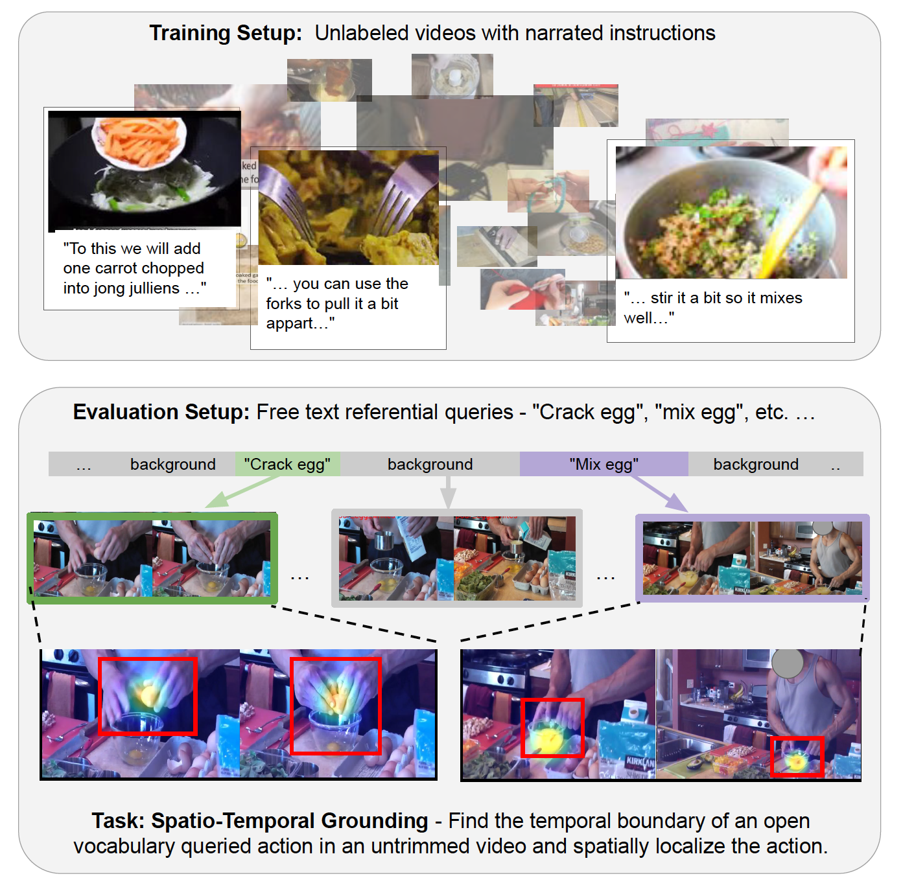

# What, when, and where? -- Self-Supervised Spatio-Temporal Grounding in Untrimmed Multi-Action Videos from Narrated Instructions
******************************************************

This repo has the implementation of our paper: [What, when, and where? -- Self-Supervised Spatio-Temporal Grounding in Untrimmed Multi-Action Videos from Narrated Instructions](https://arxiv.org/abs/2303.16990)




## Getting Started


```
$ pip install requirements.txt
```
**************************************************************

## Train Model

```
$ python -u main_distributed.py  --batch_size=64  \
--lr=1e-4 --epochs=15 --globalF  \
--CLIP --fps 1 --num_frames 8 --num_sec_control 8 --longer_frame --local_select \
--sink --checkpoint_dir=nce_b64_globalF_CLIP_1fps_8frame_num_sec_control8_local_select_sink
```
**************************************************************


## Test Model

```
$ CUDA_VISIBLE_DEVICE=1 python -W ignore eval_mining_clip_iou.py \
--eval_video_root $video_path \
--youcook2_annotations_path mining_anno/seg.json \
--interactions_annotations_path mining_anno/id2xy_box.json \
--checkpoint_eval \
checkpoint/nce_b64_globalF_CLIP_1fps_8frame_num_sec_control8_local_select_sink/epoch0009.pth.tar

```
**************************************************************


